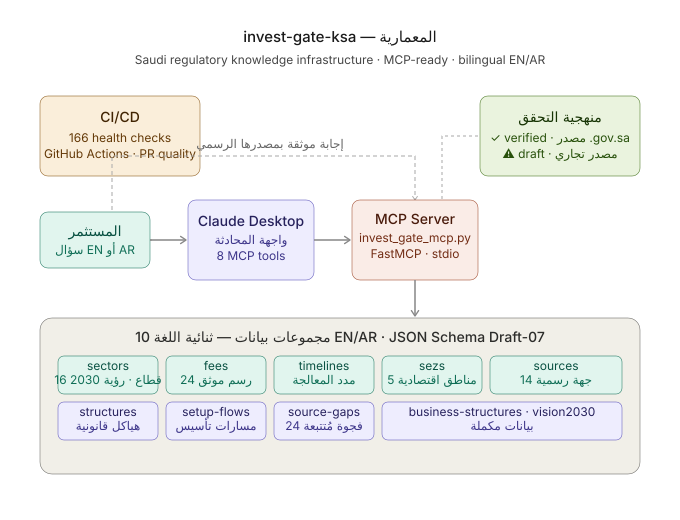
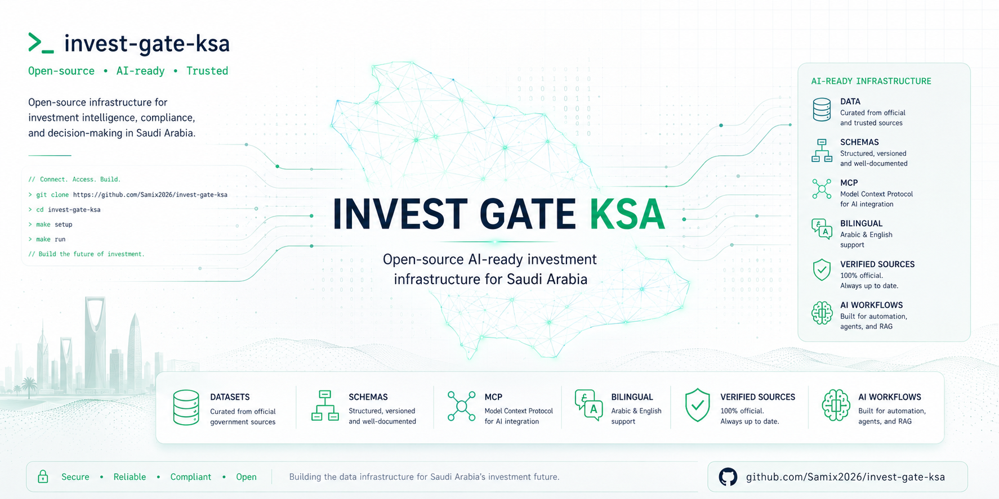

# Invest Gate KSA

## Architecture

> How a question becomes a verified answer



### Interactive System Map

Explore how an investor question moves through the MCP tools, bilingual datasets,
verification layer, and source-linked response.

[](https://samix2026.github.io/invest-gate-ksa/repo-explainer.html)

> The interactive guide is deployed through GitHub Pages. You can also
> [view its source](assets/interactive/repo-explainer.html).

The investor asks in Arabic or English → Claude Desktop routes through 8 MCP tools →
the server queries 10 bilingual datasets → every response cites its official source
with a verification status (✓ verified from .gov.sa / ⚠ draft from commercial source).

<p align="center">
  
</p>

**A bilingual, open-source knowledge infrastructure for understanding investment, company setup, licensing, and business operations in Saudi Arabia.**

---

> **Disclaimer**
> This repository contains general educational information only. It is **not legal, financial, regulatory, or tax advice**. Laws, fees, and procedures in Saudi Arabia change — always verify information directly with official government sources and consult qualified practitioners before making any decision.

---

## The Problem

Saudi Arabia has opened significantly to foreign investment. But for an investor arriving from outside the Kingdom, the path is genuinely hard to navigate: information is scattered across a dozen government portals, often in Arabic only, frequently outdated on third-party sites, and rarely organized around the questions investors actually ask.

The result is that many foreign investors rely on expensive consultants for information that should be freely accessible — or worse, proceed on misinformation.

---

## What This Is

Invest Gate KSA is a structured, community-maintained knowledge repository that organizes publicly available information about investing in Saudi Arabia into clear, source-linked, bilingual documentation — and exposes it through a working MCP server for conversational AI querying.

It is not a consultancy. It is not a legal service. It is a **reference framework** — designed to be accurate, traceable, and queryable.

---

## Quick Start

#### Option A — Query the datasets directly (CLI)

```bash
# Clone
git clone https://github.com/Samix2026/invest-gate-ksa.git
cd invest-gate-ksa

# Install
pip3 install -r scripts/requirements.txt

# Query fee schedule
python3 scripts/query-dataset.py --dataset fees --lang en --list

# Query sectors (Arabic)
python3 scripts/query-dataset.py --dataset sectors --lang ar --list

# Query Special Economic Zones
python3 scripts/query-dataset.py --dataset sezs --lang en --list

# Search across all datasets
python3 scripts/query-dataset.py --dataset all --keyword "MISA" --lang en
```

#### Option B — Connect to Claude Desktop (MCP)

```bash
pip3 install -r mcp/requirements.txt
```

Add to `~/Library/Application Support/Claude/claude_desktop_config.json`:

```json
{
  "mcpServers": {
    "invest-gate-ksa": {
      "command": "python3",
      "args": ["/absolute/path/to/invest-gate-ksa/mcp/invest_gate_mcp.py"]
    }
  }
}
```

Restart Claude Desktop. Then ask:
- "What are the steps to register a company in Saudi Arabia as a foreign investor?"
- "ما رسوم التسجيل في وزارة الاستثمار؟"
- "What are the tax obligations for a foreign company in Saudi Arabia?"

#### Option C — Use the data directly in your project

```python
import json

with open('data/fees.en.json') as f:
    fees = json.load(f)

for entry in fees['data']:
    if entry.get('verification_status') == 'verified' and entry.get('amount_sar', 0) != 0:
        print(f"{entry['id']}: SAR {entry['amount_sar']} ({entry.get('frequency', '')})")
```

---

## Example Output

**Fee schedule query** (`--dataset fees --lang en --list`):

```
fees  (en)  —  24 entries
────────────────────────────────────────────────────────────────────────────────
  ID                                NAME                          STATUS
────────────────────────────────────────────────────────────────────────────────
  misa_investment_registration_fee  Fee charged by the Ministry … verified
  misa_activity_amendment_fee       Fee charged by the Ministry … verified
  misa_ownership_amendment_fee      Fee charged by the Ministry … verified
  misa_annual_renewal_fee           Fee for the annual update of… verified
  misa_property_approval_fee        Fee charged by the Ministry … verified
  misa_registration_cancellation_fe Fee charged by the Ministry … verified
  commercial_registration_issuance_ Fee charged by the Ministry … verified
  branch_commercial_registration_fe Historical entry — Branch Co… verified
  chamber_of_commerce_fee           Annual mandatory Chamber of … verified
  gosi_employer_registration_fee    Fee, if any, charged by the … draft
  zatca_vat_registration_fee        Fee, if any, charged by the … draft
  cit_corporate_income_tax          Corporate Income Tax (CIT) c… verified
  zakat_saudi_gcc_shareholders      Zakat is an annual Islamic l… verified
  wht_withholding_tax               Withholding Tax (WHT) charge… verified
  municipal_license_riyadh_fee      Fee charged by the local mun… draft
  saudization_certificate_fee       Fee, if any, charged by the … draft
  rhq_license_year1_fee             Fee for the first year of a … draft
  rhq_license_annual_fee            Annual renewal fee for a Reg… draft
  entrepreneurial_license_fee_y1_3  Reduced MISA Entrepreneurial… verified
  entrepreneurial_license_fee_y4_5  MISA Entrepreneurial License… verified
  qiwa_employer_registration_fee    Fee for registering as an em… verified
  iqama_issuance_renewal_fee        Annual Iqama (residency perm… verified
  final_exit_visa_fee               Fee for issuing a final exit… verified
  exit_reentry_visa_extension_fee   Fee for extending an exit/re… verified
────────────────────────────────────────────────────────────────────────────────
  24 entry/entries
```

**Sector query, Arabic** (`--dataset sectors --lang ar --list`):

```
sectors  (ar)  —  16 entries
────────────────────────────────────────────────────────────────────────────────
  ID                                NAME                          STATUS
────────────────────────────────────────────────────────────────────────────────
  technology                        التقنية                       draft
  consulting                        الاستشارات والخدمات المهنية   draft
  ecommerce                         التجارة الإلكترونية           draft
  food_and_beverage                 الأغذية والمشروبات            draft
  real_estate                       العقارات                      draft
  education                         التعليم                       draft
  healthcare                        الرعاية الصحية                draft
  fintech                           التقنية المالية (فينتك)       draft
  manufacturing                     التصنيع                       draft
  industrial_services               الخدمات الصناعية              draft
  mining                            التعدين والموارد المعدنية     draft
  tourism_and_hospitality           السياحة والضيافة              draft
  media_and_content                 الإعلام والمحتوى              draft
  hajj_umrah_services               خدمات الحج والعمرة            draft
  entertainment_and_events          الترفيه والفعاليات            draft
────────────────────────────────────────────────────────────────────────────────
  16 entry/entries
```

**SEZ query** (`--dataset sezs --lang en --list`):

```
sezs  (en)  —  5 entries
────────────────────────────────────────────────────────────────────────────────
  ID                                NAME                          STATUS
────────────────────────────────────────────────────────────────────────────────
  kaec_sez                          King Abdullah Economic City … verified
  jazan_sez                         Jazan Special Economic Zone   verified
  ras_al_khair_sez                  Ras Al-Khair Special Economi… verified
  cloud_computing_sez               Cloud Computing Special Econ… verified
  silz                              Special Integrated Logistics… draft
────────────────────────────────────────────────────────────────────────────────
  5 entry/entries
```

---

## Who This Is For

| Audience | How they use it |
|---|---|
| Foreign entrepreneurs and investors | Understand the regulatory landscape before engaging advisors |
| Business setup consultants | Reference and share structured process guides |
| Researchers and academics | Source-linked overview of the Saudi investment framework |
| Developers | Knowledge base for building investment-related tools and AI assistants |
| Translators and bilingual professionals | Arabic-English alignment of business and regulatory terminology |

---

## Use Cases

**For developers:**
- Build an investment guidance chatbot for Saudi Arabia
- Power an AI agent with structured regulatory data
- Integrate via MCP with Claude Desktop or any MCP-compatible client

**For founders and investors:**
- Understand the full regulatory path before engaging consultants
- Compare business structures (LLC vs Branch vs RHQ)
- Verify fee estimates against official sources

**For researchers:**
- Structured, bilingual, source-linked regulatory dataset
- Tracks data gaps explicitly — 25 source gaps documented
- Versioned via Git with full change history

**For AI/LLM builders:**
- 10 JSON datasets with strict schema (Draft-07)
- Bilingual EN/AR with ID parity enforcement
- MCP server with 8 tools — plug into any MCP-compatible agent
- System prompt included for out-of-the-box AI assistant deployment

---

## What's Inside

| Directory / File | Contents |
|---|---|
| `data/` | 10 structured bilingual JSON datasets (EN + AR) |
| `data/sectors` | 16 investment sectors with Vision 2030 alignment |
| `data/sources` | 14 verified regulatory authority sources |
| `data/source-gaps` | 24 tracked data gaps awaiting verification |
| `data/fees` | 24 fee entries — verified entries cite official sources |
| `data/timelines` | 10 processing time entries — verified against official publications |
| `data/sezs` | 5 Special Economic Zones (KAEC, Jazan, Ras Al-Khair, Cloud, SILZ) |
| `data/setup-flows` | 4 registration flows by scenario (consulting, e-commerce, manufacturing, fintech) |
| `data/business-structures` | 4 entity types (LLC, JSC, Branch Office, Representative Office) |
| `data/authority-relationships` | 12 regulatory authority relationship mappings |
| `data/investment-licenses` | 5 registration and licensing concepts in setup sequence |
| `schemas/` | JSON Schema Draft-07 — strict typing, additionalProperties: false |
| `docs/en/` | English guides: registration, tax, SEZs, Vision 2030, structures |
| `docs/ar/` | Arabic mirrors (RTL) — full bilingual parity enforced |
| `mcp/` | FastMCP server — 8 query tools for Claude Desktop integration |
| `.claude/commands/` | 6 slash commands for daily repository operations |
| `prompts/` | AI system prompt (bilingual, citation rules, legal disclaimer) |
| `scripts/` | 184-check validation suite (JSON, schema, parity, cross-refs) |
| `sources/` | Citation registry — every claim source-linked |
| `templates/` | Investor checklists — planned |
| `.github/workflows/` | CI/CD — validation on every push and PR |

---

## Core Coverage

- Full regulatory path: MISA → CR → Chamber of Commerce → ZATCA → GOSI → Qiwa → Muqeem
- Registration types: Standard Investment Registration, RHQ, Entrepreneurial
- Tax framework: CIT 20% (foreign), Zakat 2.5% (Saudi/GCC), VAT 15%, WHT 5–20%
- Special Economic Zones: KAEC, Jazan, Ras Al-Khair, Cloud Computing, SILZ (5% CIT)
- Vision 2030 sector alignment: 16 sectors with official targets and supervising entities
- Fee schedules and processing timelines — verified against official sources
- 2025 regulatory updates: new CR Law (April 2025), Investment Law (August 2024)

---

## Project Status

| Phase | Progress | Status | Description |
|---|---|---|---|
| Phase 1 — Foundation | ██████████ | Complete | Schemas, CI/CD, 184-check validation suite |
| Phase 2 — Knowledge Base | ████████░░ | Active | 10 datasets, 5 verified core paths, SEZs, V2030 |
| Phase 3 — AI Workflows | ██████████ | Complete | System prompt, 8 MCP tools |
| Phase 4 — MCP Integration | ██████████ | Complete | Claude Desktop ready (stdio) |
| Phase 5 — Product Layer | ░░░░░░░░░░ | Planned | — |

**Verification status (2026-05-20):**
- ✅ Verified against official sources: MISA registration, CR (MoC), Chamber of Commerce, ZATCA (CIT + VAT + WHT), GOSI, Qiwa, Muqeem, SEZs (ECZA + Official Gazette Jan 2026), Vision 2030 KPIs
- ⚠️ Draft — pending official confirmation: RHQ registration fees, SILZ tax details
- 📋 Planned: economic-activities dataset, investor checklist templates

See [roadmap.md](roadmap.md) for the full task breakdown.

---

## MCP Server — Claude Desktop Integration

Connect Claude Desktop directly to this knowledge base for conversational querying.

**Install:**
```bash
pip3 install -r mcp/requirements.txt
```

**Configure** (`~/Library/Application Support/Claude/claude_desktop_config.json`):
```json
{
  "mcpServers": {
    "invest-gate-ksa": {
      "command": "python3",
      "args": ["/absolute/path/to/invest-gate-ksa/mcp/invest_gate_mcp.py"]
    }
  }
}
```

**Available tools:**
`query_sectors` · `query_authorities` · `query_setup_flows` · `query_fees` · `query_timelines` · `query_structures` · `get_investor_path` · `search_knowledge_base`

See [mcp/README.md](mcp/README.md) for full setup instructions.

---

## Verification Methodology

Every data entry carries an explicit verification status: **verified** (confirmed from an official .gov.sa source or Official Gazette), **draft** (from credible sources but not officially confirmed), or **placeholder** (gap acknowledged, not yet researched). Unverified entries are never presented as fact — they carry a disclaimer and a `verify_at` link. See [docs/en/source-verification.md](docs/en/source-verification.md) for the full workflow.

---

## Contributing

This project grows through the knowledge of people with direct, documented experience. We welcome contributions from consultants, lawyers, researchers, investors, and developers.

**What we need most:**
- Verified fee amounts from official sources (especially RHQ, SILZ)
- Economic activities dataset (MISA activity codes with foreign ownership eligibility)
- Investor checklist templates (LLC, Branch, MISA documents)
- Corrections to any outdated information

Every piece of content must cite an official source. See [CONTRIBUTING.md](CONTRIBUTING.md) for guidelines.

---

## Run Health Checks

```bash
python3 scripts/check.py
```

Runs 184 checks: required files, JSON validity, schema validation, alias integrity, cross-reference integrity, bilingual parity. Exits `0` on full pass.

---

## Browse the Docs

- [English Documentation →](docs/en/README.md)
- [الوثائق العربية →](docs/ar/README.md)
- [Registration Types →](docs/en/registration-types.md)
- [Special Economic Zones →](docs/en/special-economic-zones.md)
- [Vision 2030 Sector Guide →](docs/en/vision2030-sectors.md)
- [Tax Obligations →](docs/en/company-setup-overview.md)
- [Saudization (Nitaqat) Guide →](docs/en/nitaqat-saudization.md)
- [Corporate Banking Guide →](docs/en/corporate-banking.md)
- [Tax Compliance Guide →](docs/en/tax-compliance.md)
- [Source Verification →](docs/en/source-verification.md)
- [Sources Index →](sources/index.md)

---

## License

[MIT License](LICENSE) — free to use, adapt, and distribute with attribution.

The content (guides, data, templates) is educational, not advisory. See [LICENSE](LICENSE) for the full disclaimer.
